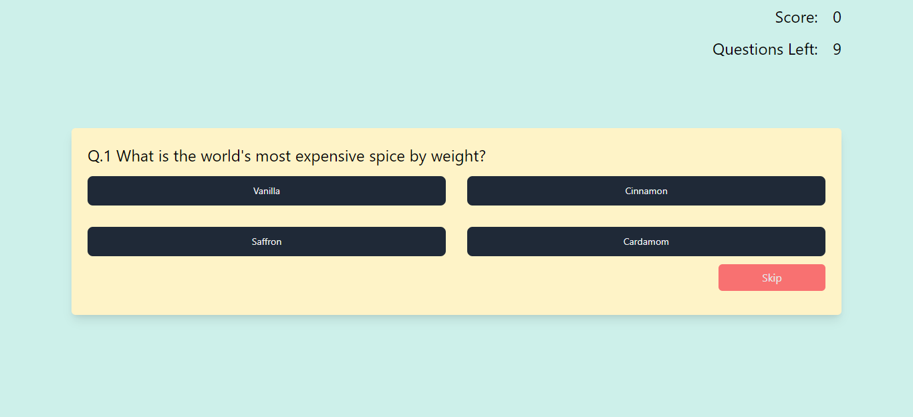

# Quizeer - Quiz App created with react js and typescript .

## Setup

- Clone the repo .
- run ``yarn install`` .
- Generate your custom endpoint from [opentdb](https://opentdb.com/api_config.php) and add to ``ENDPOINT`` variable in ``Mainpage.tsx``.
- Run ``yarn start`` to start the project.
  

## About The Project.
- Project is created with react and typescript
- for styling I have used tailwind css.
- context api has been utilized for keeping the score of the user.
    
